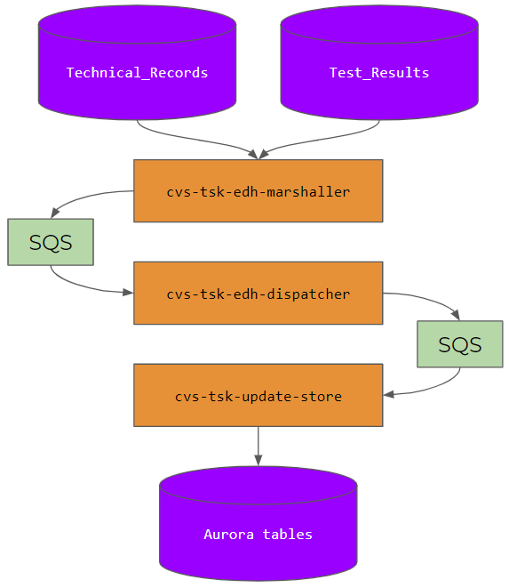

# cvs-tsk-update-store

## Overview
Lambda handler and business logic for the CVS task "Update Store":

1. Receives DynamoDB stream events, containing NoSQL document snapshots ("**images**")
2. Converts these images to a TypeScript model, then to an SQL-friendly tuple.
3. Upserts (inserts or updates) tuples into RDS [Aurora][aurora], a relational SQL database.

See full conversion procedure in sections below.

This Lambda currently supports the following conversions:

| Source (DynamoDB)   | Destination (Aurora) |
|---------------------|----------------------|
| `Technical_Records` | `technical_record`   |
| `Test_Results`      | `test_result`        |

See full list of affected Aurora tables in sections below.

### Relation to other services
`cvs-tsk-update-store` was built as part of the **VOTT** project. See:
* [Project home](https://wiki.dvsacloud.uk/display/HVT/Vehicle+Operator+Test+Transparency)
* [Architecture diagram](https://wiki.dvsacloud.uk/pages/viewpage.action?spaceKey=HVT&title=VOTT+Architecture)
* The following diagram:



### Cloning
This project makes use of [Git submodules][git-submodules] to import [cvs-nop][cvs-nop]. Instead of the regular `git clone`, use:

```shell
git clone git@github.com:dvsa/cvs-tsk-update-store.git --recurse-submodules
```

Or, if already cloned:

```shell
git submodule update --init --recursive
```

By default, the submodule will be in a detached `HEAD` state. If you need a specific branch on `cvs-nop`, you will need to:

```shell
cd cvs-nop
git checkout feature/CVSB-XXXXX
git pull
```

### Debugging
`cvs-tsk-update-store` is **quiet by default**. It will log almost nothing to CloudWatch unless an error occurs.

To change this, set the environment variable `DEBUG` to any non-null value, e.g. `DEBUG=1`.

This will cause numerous debug logs to fire. Messages will include event information, SQL, template variables, procedure entries and exits and more.

### Tests
```shell
npm run test
```
Runs all unit tests

```shell
npm run test-all
```
Runs all the tests (Unit and Integration)

### Integration tests
Integration tests depend on:
* a local Docker installation, with `docker` on the system's path
* a local Liquibase installation, with `liquibase` or `liquibase.bat` (on Windows) on the system's path

They work by:
1. Creating a MySQL container
2. Spawning a Liquibase executable
3. Applying a Liquibase changelog to the running container
4. Overriding connection pool configuration to connect to container

Run them using:
```shell
npm run test-local-i
```

On Windows, you will need to manually run:
* `SET USE_CONTAINERIZED_DATABASE=1`
* Confirm: `echo %USE_CONTAINERIZED_DATABASE%` should return `1`before the above, or run these tests with an IntelliJ configuration which sets the right environment variable for you.

On Tanio Artino's advice, there is a distinction between running integration tests locally, and running them on Jenkins.
* `USE_CONTAINERIZED_DATABASE=0` will attempt to talk to `127.0.0.1:3306`. This only works if you manually start a DB or, in the case of Jenkins, if there is a pre-existing DB running on port `3306`.
* `USE_CONTAINERIZED_DATABASE=1` will spin up a TC container as described above.

To run the "Jenkins" version, e.g. `USE_CONTAINERIZED_DATABASE=0`, use:
```shell
npm run test-i
```

## Full conversion procedure
Rough ordering - may not follow code exactly.

1. DynamoDB table emits event on `INSERT`, `MODIFY` or `REMOVE`
2. Event validation: is this really a DynamoDB stream event?
3. Derive correct SQL operation `INSERT` (supported), `UPDATE` (supported) or `DELETE` (not implemented)
4. Parse DynamoDB document snapshot into usable image object
5. Obtain source table name from event source ARN
6. Get conversion procedure by table name
7. Start conversion procedure given image, table name and SQL operation
8. Parse root image: map all applicable fields to equivalent TypeScript object hierarchy
9. Generate `INSERT INTO (...) ON DUPLICATE KEY UPDATE (...)` for each destination table
10. Transactionally execute all SQL statements, rolling back on error
11. Return upsertion result containing all primary and foreign keys

## Technical Record conversion
For the full field-to-column mapping, see `tech-record-document-conversion.ts`.

* Source (DynamoDB) table: `Technical_Records`
* Destination (Aurora) tables, in upsertion order:
  * `vehicle`
  * `make_model`
  * `vehicle_class`
  * `vehicle_subclass`
  * `identity`
  * `contact_details`
  * `technical_record`
  * `psv_brakes`
  * `axle_spacing`
  * `microfilm`
  * `plate`
  * `axle`

## Test Result conversion
For the full field-to-column mapping, see `test-result-record-conversion.ts`.

* Source (DynamoDB) table: `Test_Results`
* Destination (Aurora) tables, in upsertion order:
  * `vehicle`
  * `test_station`
  * `tester`
  * `vehicle_class`
  * `preparer`
  * `identity`
  * `fuel_emission`
  * `test_type`
  * `test_result`
  * `defect`
  * `location`
  * `test_defect`
  * `custom_defect`

[aurora]: https://aws.amazon.com/rds/aurora
[git-submodules]: https://git-scm.com/book/en/v2/Git-Tools-Submodules
[cvs-nop]: https://github.com/dvsa/cvs-nop
